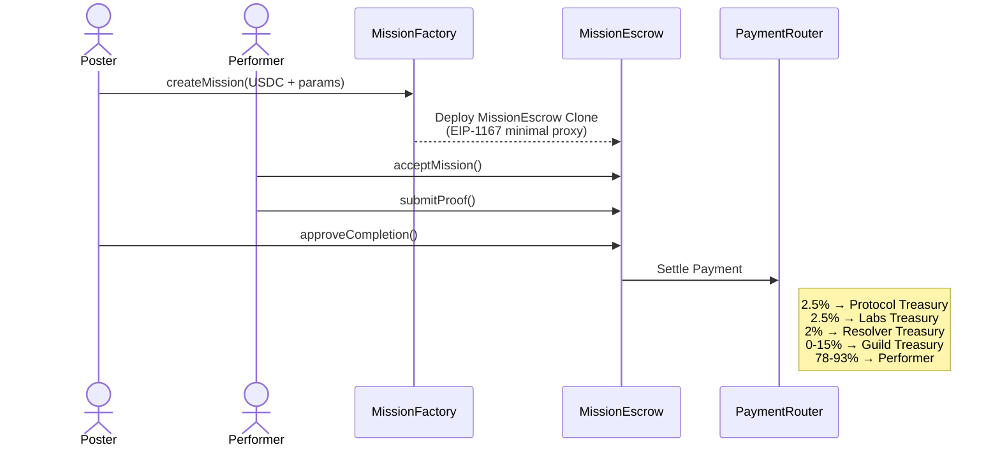

> **Note: Auto-Synced Read-Only Mirror**
>
> This is an **auto-synced read-only mirror** of `packages/contracts` from the [main monorepo](https://github.com/HrznLabs/horizon).
> It mirrors the full contract package: core (v2.2 + June 2026 audit fixes), M5 token stack, iTake vertical, governance, and all scripts/tests.
> A GitHub Actions workflow (`mirror-contracts.yml` in the monorepo) keeps this repo in sync on every push to monorepo `main`.
>
> **Do not submit PRs here** — contribute to the monorepo instead. Bot-generated optimization PRs are automatically closed.

# Horizon Protocol Smart Contracts

[](https://opensource.org/licenses/MIT)
[](https://docs.soliditylang.org/)
[](https://book.getfoundry.sh/)
[](https://base.org)
[](https://gitpod.io/#https://github.com/HrznLabs/horizon-contracts)

**Decentralized mission coordination protocol built on Base (Optimism L2).**

Horizon Protocol enables trustless, escrow-backed task coordination with USDC payments, reputation attestations, dispute resolution, and community governance through DAOs.

## 📖 Table of Contents

- [Why Horizon?](#-why-horizon)
- [Deployed Contracts](#-deployed-contracts-base-sepolia)
- [Overview](#-overview)
- [Architecture](#-architecture)
- [Contract Suite](#-contract-suite)
- [Getting Started](#-getting-started)
- [Interfaces](#-interfaces)
- [Security](#-security)
- [SDK](#-sdk)
- [Links](#-links)

## 🎯 Why Horizon?

- **Non-custodial** - Funds in escrow, protocol never controls user assets
- **Trust-minimized** - On-chain reputation and dispute resolution
- **Community-driven** - Guild DAOs curate and govern local markets
- **Gas-efficient** - EIP-1167 minimal proxies for 90%+ gas savings
- **Privacy-preserving** - Location precision controls, opt-in tracking only

## 🌐 Deployed Contracts (Base Sepolia)

> Full address listing (including M5 token stack and iTake vertical) in [DEPLOYED_ADDRESSES.md](./DEPLOYED_ADDRESSES.md).

### Core (Phase 13 redeploy, 2026-03-10)

| Contract | Address | Verified |
|----------|---------|----------|
| [MissionFactory](./src/MissionFactory.sol) | [`0x6d97964E9BE016A8AABA2f99F0bA419464Fb88D9`](https://sepolia.basescan.org/address/0x6d97964E9BE016A8AABA2f99F0bA419464Fb88D9#code) | [✅](https://sepolia.basescan.org/address/0x6d97964E9BE016A8AABA2f99F0bA419464Fb88D9#code) |
| [PaymentRouter](./src/PaymentRouter.sol) | [`0x3013db6C92EF956f86EBC0aDFECe70b80FA73600`](https://sepolia.basescan.org/address/0x3013db6C92EF956f86EBC0aDFECe70b80FA73600#code) | [✅](https://sepolia.basescan.org/address/0x3013db6C92EF956f86EBC0aDFECe70b80FA73600#code) |
| [GuildFactory](./src/GuildFactory.sol) | [`0x7349Cd1A4f7C1a74Db730743d873de98A2f3a32F`](https://sepolia.basescan.org/address/0x7349Cd1A4f7C1a74Db730743d873de98A2f3a32F#code) | [✅](https://sepolia.basescan.org/address/0x7349Cd1A4f7C1a74Db730743d873de98A2f3a32F#code) |
| [MissionEscrow (Impl)](./src/MissionEscrow.sol) | [`0x3b02a7eac30Bc4a800Eebd69Fed75c818dB92099`](https://sepolia.basescan.org/address/0x3b02a7eac30Bc4a800Eebd69Fed75c818dB92099#code) | [✅](https://sepolia.basescan.org/address/0x3b02a7eac30Bc4a800Eebd69Fed75c818dB92099#code) |
| [DisputeResolver](./src/DisputeResolver.sol) | [`0xdE37Ff10A487c852941DC842987dd8d5d8b9E855`](https://sepolia.basescan.org/address/0xdE37Ff10A487c852941DC842987dd8d5d8b9E855#code) | [✅](https://sepolia.basescan.org/address/0xdE37Ff10A487c852941DC842987dd8d5d8b9E855#code) |
| [HorizonAchievements](./src/HorizonAchievements.sol) | [`0xfCC5971C3704C7a1F1c9E4acFdC7eEd60D4e4949`](https://sepolia.basescan.org/address/0xfCC5971C3704C7a1F1c9E4acFdC7eEd60D4e4949#code) | [✅](https://sepolia.basescan.org/address/0xfCC5971C3704C7a1F1c9E4acFdC7eEd60D4e4949#code) |

**Base Sepolia USDC:** [`0x036CbD53842c5426634e7929541eC2318f3dCF7e`](https://sepolia.basescan.org/address/0x036CbD53842c5426634e7929541eC2318f3dCF7e#code) | **EURC:** [`0x808456652fdb597867f38412077A9182bf77359F`](https://sepolia.basescan.org/address/0x808456652fdb597867f38412077A9182bf77359F#code)

## 📋 Overview

Horizon Protocol is a decentralized platform for coordinating real-world tasks (missions) with:

- **USDC Escrow** - Funds locked until mission completion
- **Minimal Proxy Deployment** - Gas-efficient EIP-1167 clones
- **Multi-party Fee Distribution** - Protocol, Labs, Resolver, Guild, and Performer splits
- **Dispute Resolution** - DDR (Dynamic Dispute Reserve) and LPP (Loser-Pays Penalty)
- **Reputation System** - On-chain ratings and attestations via EAS
- **Guild Governance** - Community-driven mission curation
- **Achievement NFTs** - Soulbound and tradable achievements

## 🏗️ Architecture


```mermaid
sequenceDiagram
    actor Poster
    actor Performer
    participant MF as MissionFactory
    participant ME as MissionEscrow
    participant PR as PaymentRouter

    Poster->>MF: createMission(USDC + params)
    MF-->>ME: Deploy MissionEscrow Clone<br/>(EIP-1167 minimal proxy)

    Performer->>ME: acceptMission()
    Performer->>ME: submitProof()

    Poster->>ME: approveCompletion()

    ME->>PR: Settle Payment

    Note right of PR: 2.5% → Protocol Treasury<br/>2.5% → Labs Treasury<br/>2% → Resolver Treasury<br/>0-15% → Guild Treasury<br/>78-93% → Performer
```

## 📦 Contract Suite

### Core Contracts

#### [`MissionFactory.sol`](./src/MissionFactory.sol)
Factory for deploying `MissionEscrow` clones using EIP-1167 minimal proxies.

```solidity
function createMission(
    uint256 rewardAmount,    // USDC amount (6 decimals)
    uint256 expiresAt,       // Expiration timestamp
    address guild,           // Optional guild address
    bytes32 metadataHash,    // IPFS hash of mission metadata
    bytes32 locationHash     // IPFS hash of location data
) external returns (uint256 missionId);
```

#### [`MissionEscrow.sol`](./src/MissionEscrow.sol)
Individual escrow contract for each mission with full lifecycle management.

**States:** `Open` → `Accepted` → `Submitted` → `Completed`/`Cancelled`/`Disputed`

```solidity
function acceptMission() external;           // Performer accepts
function submitProof(bytes32 proofHash) external;  // Submit completion proof
function approveCompletion() external;       // Poster approves
function cancelMission() external;           // Cancel if not accepted
function raiseDispute(bytes32 disputeHash) external;  // Raise dispute
function claimExpired() external;            // Claim expired mission funds
```

#### [`PaymentRouter.sol`](./src/PaymentRouter.sol)
Routes payments with configurable fee splits.

**Fee Structure:**

| Fee Type | Percentage | BPS | Recipient |
|----------|------------|-----|-----------|
| Protocol Fee | 2.5% | 250 BPS | Protocol Treasury |
| Labs Fee | 2.5% | 250 BPS | Labs Treasury |
| Resolver Fee | 2% | 200 BPS | Resolver Treasury |
| Guild Fee | max 3% (MetaDAO 1% + SubDAO 2%) | 0-300 BPS | Guild Treasury |
| Performer | 90%+ guaranteed | — | Performer |

#### [`DisputeResolver.sol`](./src/DisputeResolver.sol)
Handles mission disputes with economic incentives.

**Mechanisms:**

| Mechanism | Value | Description |
|-----------|-------|-------------|
| DDR (Dynamic Dispute Reserve) | 5% | Deposited by both parties when dispute is raised |
| LPP (Loser-Pays Penalty) | 2% | Penalty redistributed to winner + resolver |
| Appeal Period | 48 hours | Time before dispute can be finalized |

- **DAO Override:** Protocol DAO can override resolutions

### Governance Contracts

#### [`GuildDAO.sol`](./src/GuildDAO.sol)
Guild governance with role-based access control.

**Roles:**
- `ADMIN_ROLE` - Full guild control
- `OFFICER_ROLE` - Member management
- `CURATOR_ROLE` - Mission board curation

#### [`GuildFactory.sol`](./src/GuildFactory.sol)
Factory for deploying `GuildDAO` clones.

### Supporting Contracts

#### [`ReputationOracle.sol`](./src/ReputationOracle.sol)
On-chain reputation scoring with quality-weighted ratings (replaces ReputationAttestations).

```solidity
function submitRating(
    uint256 missionId,
    address ratee,
    uint8 score,        // 1-5
    bytes32 commentHash
) external;

function getAverageRating(address user) external view returns (uint256 average, uint256 count);
```

#### [`HorizonAchievements.sol`](./src/HorizonAchievements.sol)
ERC-721 achievements with soulbound support.

**Categories:**
- Milestone (first mission, 100 missions, etc.)
- Performance (speed runner, perfect rating)
- Guild-related achievements
- Seasonal/limited-time
- Special events

```solidity
function mintAchievement(address to, uint256 typeId, bytes32 proofHash) external returns (uint256 tokenId);
function createAchievementType(...) external returns (uint256 typeId);
function hasAchievement(address user, uint256 typeId) external view returns (bool);
```

## 🚀 Getting Started

### Prerequisites

- [Foundry](https://book.getfoundry.sh/getting-started/installation)
- [Node.js](https://nodejs.org/) (for scripts)

### Network Setup (Base Sepolia)

- **RPC URL:** `https://sepolia.base.org` (or use [Alchemy](https://alchemy.com) / [Infura](https://infura.io))
- **Explorer API Key:** [BaseScan API Key](https://basescan.org/myapikey)
- **Chain ID:** `84532`
- **Add to Wallet:** [Chainlist](https://chainlist.org/chain/84532)
- **Currency:** ETH
- **Explorer:** [Base Sepolia Scan](https://sepolia.basescan.org)
- **Faucets:**
  - [Coinbase Developer Platform Faucet](https://portal.cdp.coinbase.com/products/faucet) (ETH & USDC)
  - [Base Network Faucets Docs](https://docs.base.org/base-chain/tools/network-faucets)

### Installation

```bash
# Clone the repository
git clone https://github.com/HrznLabs/horizon-contracts.git
cd horizon-contracts

# Install dependencies
forge install

# Build
forge build
```

### Testing

```bash
# Run all tests
forge test

# Run with verbosity
forge test -vvv

# Run specific test
forge test --match-test testCreateMission

# Gas report
forge test --gas-report
```

### Developer Commands (Makefile)

A `Makefile` is included to simplify common tasks:

```bash
make all            # Clean, install, and build
make test           # Run tests
make test-v         # Run tests with verbosity
make gas            # Run gas report
make deploy-sepolia # Deploy to Base Sepolia
make verify         # Verify contract
```

### Deployment

```bash
# Configure environment
cp .env.example .env

# Edit .env with your private key and API keys
# DEPLOYER_PRIVATE_KEY=0x...
# BASE_RPC_URL=https://sepolia.base.org
# BASESCAN_API_KEY=...

# Deploy to Base Sepolia
forge script script/Deploy.s.sol --rpc-url base_sepolia --broadcast --verify
```

## 📖 Interfaces

All contracts implement well-defined interfaces for integration:

- [`IMissionEscrow.sol`](./src/interfaces/IMissionEscrow.sol) - Mission lifecycle interface
- [`IPaymentRouter.sol`](./src/interfaces/IPaymentRouter.sol) - Payment routing interface
- [`IDisputeResolver.sol`](./src/interfaces/IDisputeResolver.sol) - Dispute resolution interface

## 🔒 Security

### Security Features

- **ReentrancyGuard** on all external calls
- **SafeERC20** for token transfers
- **Access Control** with role-based permissions (OpenZeppelin)
- **Immutable parameters** for critical configuration
- **CEI pattern** (Checks-Effects-Interactions) throughout
- **Custom errors** for gas efficiency
- **Events** for all state changes

### Audit Status

⚠️ **These contracts have not been formally audited.** Use at your own risk on testnet.

### Security Invariants

1. `rewardAmount` immutable after mission creation
2. `performer` immutable after mission acceptance
3. Escrow funds can only exit via: settlement, expiry, or dispute resolution
4. DDR deposits required before dispute resolution
5. Appeal period must pass before dispute finalization

## 🛠️ SDK

For TypeScript integration, use our SDK:

```bash
yarn add @horizon-protocol/sdk viem
```

See [horizon-sdk](https://github.com/HrznLabs/horizon-sdk) for documentation.

## 📄 License

MIT License - see [LICENSE](./LICENSE)

## 🔗 Links

- [SDK Repository](https://github.com/HrznLabs/horizon-sdk)
- [Base Sepolia Explorer](https://sepolia.basescan.org)
- [Verified Contracts](#-deployed-contracts-base-sepolia)

---

Built with ❤️ by Horizon Labs | Powered by Base (Optimism L2)
