# Horizon Protocol Smart Contracts

[](https://opensource.org/licenses/MIT)
[](https://docs.soliditylang.org/)
[](https://book.getfoundry.sh/)
[](https://base.org)

**Decentralized mission coordination protocol built on Base (Optimism L2).**

Horizon Protocol enables trustless, escrow-backed task coordination with USDC payments, reputation attestations, dispute resolution, and community governance through DAOs.

## 🎯 Why Horizon?

- **Non-custodial** - Funds in escrow, protocol never controls user assets
- **Trust-minimized** - On-chain reputation and dispute resolution
- **Community-driven** - Guild DAOs curate and govern local markets
- **Gas-efficient** - EIP-1167 minimal proxies for 90%+ gas savings
- **Privacy-preserving** - Location precision controls, opt-in tracking only

## 🌐 Deployed Contracts (Base Sepolia)

| Contract | Address | Verified |
|----------|---------|----------|
| PaymentRouter | [`0x94fb7908257ec36f701d2605b51eefed4326ddf5`](https://sepolia.basescan.org/address/0x94fb7908257ec36f701d2605b51eefed4326ddf5) | ✅ |
| MissionFactory | [`0xee9234954b134c39c17a75482da78e46b16f466c`](https://sepolia.basescan.org/address/0xee9234954b134c39c17a75482da78e46b16f466c) | ✅ |
| MissionEscrow (Implementation) | [`0x873Ea710B6b289b0e9D6867B1630066e9721B5c9`](https://sepolia.basescan.org/address/0x873Ea710B6b289b0e9D6867B1630066e9721B5c9) | ✅ |
| GuildFactory | [`0xfeae3538a4a1801e47b6d16104aa8586edb55f00`](https://sepolia.basescan.org/address/0xfeae3538a4a1801e47b6d16104aa8586edb55f00) | ✅ |
| ReputationAttestations | [`0xedae9682a0fb6fb3c18d6865461f67db7d748002`](https://sepolia.basescan.org/address/0xedae9682a0fb6fb3c18d6865461f67db7d748002) | ✅ |
| DisputeResolver | [`0xb00ac4278129928aecc72541b0bcd69d94c1691e`](https://sepolia.basescan.org/address/0xb00ac4278129928aecc72541b0bcd69d94c1691e) | ✅ |
| HorizonAchievements | [`0x568e0e3102bfa1f4045d3f62559c0f9823b469bc`](https://sepolia.basescan.org/address/0x568e0e3102bfa1f4045d3f62559c0f9823b469bc) | ✅ |

**Base Sepolia USDC:** [`0x036CbD53842c5426634e7929541eC2318f3dCF7e`](https://sepolia.basescan.org/address/0x036CbD53842c5426634e7929541eC2318f3dCF7e)

## 📋 Overview

Horizon Protocol is a decentralized platform for coordinating real-world tasks (missions) with:

- **USDC Escrow** - Funds locked until mission completion
- **Minimal Proxy Deployment** - Gas-efficient EIP-1167 clones
- **Multi-party Fee Distribution** - Protocol, Labs, Resolver, Guild, and Performer splits
- **Dispute Resolution** - DDR (Dynamic Dispute Reserve) and LPP (Loser-Pays Penalty)
- **Reputation System** - On-chain ratings and attestations via EAS
- **Guild Governance** - Community-driven mission curation
- **Achievement NFTs** - Soulbound and tradable achievements

## 🏗️ Architecture

```mermaid
sequenceDiagram
    actor Poster
    actor Performer
    participant MF as MissionFactory
    participant ME as MissionEscrow
    participant PR as PaymentRouter

    Poster->>MF: createMission(USDC + params)
    MF-->>ME: Deploy MissionEscrow Clone<br/>(EIP-1167 minimal proxy)

    Performer->>ME: acceptMission()
    Performer->>ME: submitProof()

    Poster->>ME: approveCompletion()

    ME->>PR: Settle Payment

    Note right of PR: 4% → Protocol Treasury<br/>4% → Labs Treasury<br/>2% → Resolver Treasury<br/>0-15% → Guild Treasury<br/>75-90% → Performer
```



## 📦 Contract Suite

### Core Contracts

#### `MissionFactory.sol`
Factory for deploying `MissionEscrow` clones using EIP-1167 minimal proxies.

```solidity
function createMission(
    uint256 rewardAmount,    // USDC amount (6 decimals)
    uint256 expiresAt,       // Expiration timestamp
    address guild,           // Optional guild address
    bytes32 metadataHash,    // IPFS hash of mission metadata
    bytes32 locationHash     // IPFS hash of location data
) external returns (uint256 missionId);
```

#### `MissionEscrow.sol`
Individual escrow contract for each mission with full lifecycle management.

**States:** `Open` → `Accepted` → `Submitted` → `Completed`/`Cancelled`/`Disputed`

```solidity
function acceptMission() external;           // Performer accepts
function submitProof(bytes32 proofHash) external;  // Submit completion proof
function approveCompletion() external;       // Poster approves
function cancelMission() external;           // Cancel if not accepted
function raiseDispute(bytes32 disputeHash) external;  // Raise dispute
function claimExpired() external;            // Claim expired mission funds
```

#### `PaymentRouter.sol`
Routes payments with configurable fee splits.

**Fee Structure:**
- Protocol: 4% (fixed)
- Labs: 4% (fixed)
- Resolver: 2% (fixed)
- Guild: 0-15% (variable, set by guild)
- Performer: 90% - guildFee

#### `DisputeResolver.sol`
Handles mission disputes with economic incentives.

**Mechanisms:**
- **DDR (Dynamic Dispute Reserve):** 5% deposit from each party
- **LPP (Loser-Pays Penalty):** 2% penalty redistributed
- **Appeal Period:** 48 hours before finalization
- **DAO Override:** Protocol DAO can override resolutions

### Governance Contracts

#### `GuildDAO.sol`
Guild governance with role-based access control.

**Roles:**
- `ADMIN_ROLE` - Full guild control
- `OFFICER_ROLE` - Member management
- `CURATOR_ROLE` - Mission board curation

#### `GuildFactory.sol`
Factory for deploying `GuildDAO` clones.

### Supporting Contracts

#### `ReputationAttestations.sol`
On-chain reputation and rating storage.

```solidity
function submitRating(
    uint256 missionId,
    address ratee,
    uint8 score,        // 1-5
    bytes32 commentHash
) external;

function getAverageRating(address user) external view returns (uint256 average, uint256 count);
```

#### `HorizonAchievements.sol`
ERC-721 achievements with soulbound support.

**Categories:**
- Milestone (first mission, 100 missions, etc.)
- Performance (speed runner, perfect rating)
- Guild-related achievements
- Seasonal/limited-time
- Special events

```solidity
function mintAchievement(address to, uint256 typeId, bytes32 proofHash) external returns (uint256 tokenId);
function createAchievementType(...) external returns (uint256 typeId);
function hasAchievement(address user, uint256 typeId) external view returns (bool);
```

## 🚀 Getting Started

### Prerequisites

- [Foundry](https://book.getfoundry.sh/getting-started/installation)
- [Node.js](https://nodejs.org/) (for scripts)

### Installation

```bash
# Clone the repository
git clone https://github.com/HrznLabs/horizon-contracts.git
cd horizon-contracts

# Install dependencies
forge install

# Build
forge build
```

### Testing

```bash
# Run all tests
forge test

# Run with verbosity
forge test -vvv

# Run specific test
forge test --match-test testCreateMission

# Gas report
forge test --gas-report
```

### Developer Commands (Makefile)

A `Makefile` is included to simplify common tasks:

```bash
make all            # Clean, install, and build
make test           # Run tests
make test-v         # Run tests with verbosity
make gas            # Run gas report
make deploy-sepolia # Deploy to Base Sepolia
make verify         # Verify contract
```

### Deployment

```bash
# Configure environment
cp .env.example .env

# Edit .env with your private key and API keys
# DEPLOYER_PRIVATE_KEY=0x...
# BASE_RPC_URL=https://sepolia.base.org
# BASESCAN_API_KEY=...

# Deploy to Base Sepolia
forge script script/Deploy.s.sol --rpc-url base_sepolia --broadcast --verify
```

## 📖 Interfaces

All contracts implement well-defined interfaces for integration:

- `IMissionEscrow.sol` - Mission lifecycle interface
- `IPaymentRouter.sol` - Payment routing interface
- `IDisputeResolver.sol` - Dispute resolution interface

## 🔒 Security

### Security Features

- **ReentrancyGuard** on all external calls
- **SafeERC20** for token transfers
- **Access Control** with role-based permissions (OpenZeppelin)
- **Immutable parameters** for critical configuration
- **CEI pattern** (Checks-Effects-Interactions) throughout
- **Custom errors** for gas efficiency
- **Events** for all state changes

### Audit Status

⚠️ **These contracts have not been formally audited.** Use at your own risk on testnet.

### Security Invariants

1. `rewardAmount` immutable after mission creation
2. `performer` immutable after mission acceptance
3. Escrow funds can only exit via: settlement, expiry, or dispute resolution
4. DDR deposits required before dispute resolution
5. Appeal period must pass before dispute finalization

## 🛠️ SDK

For TypeScript integration, use our SDK:

```bash
yarn add @horizon-protocol/sdk viem
```

See [horizon-sdk](https://github.com/HrznLabs/horizon-sdk) for documentation.

## 📄 License

MIT License - see [LICENSE](./LICENSE)

## 🔗 Links

- [SDK Repository](https://github.com/HrznLabs/horizon-sdk)
- [Base Sepolia Explorer](https://sepolia.basescan.org)
- [Verified Contracts](https://sepolia.basescan.org/address/0xee9234954b134c39c17a75482da78e46b16f466c)

---

Built with ❤️ by Horizon Labs | Powered by Base (Optimism L2)
